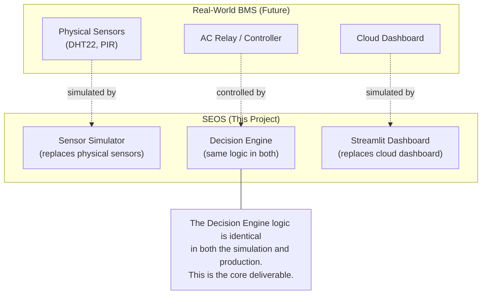
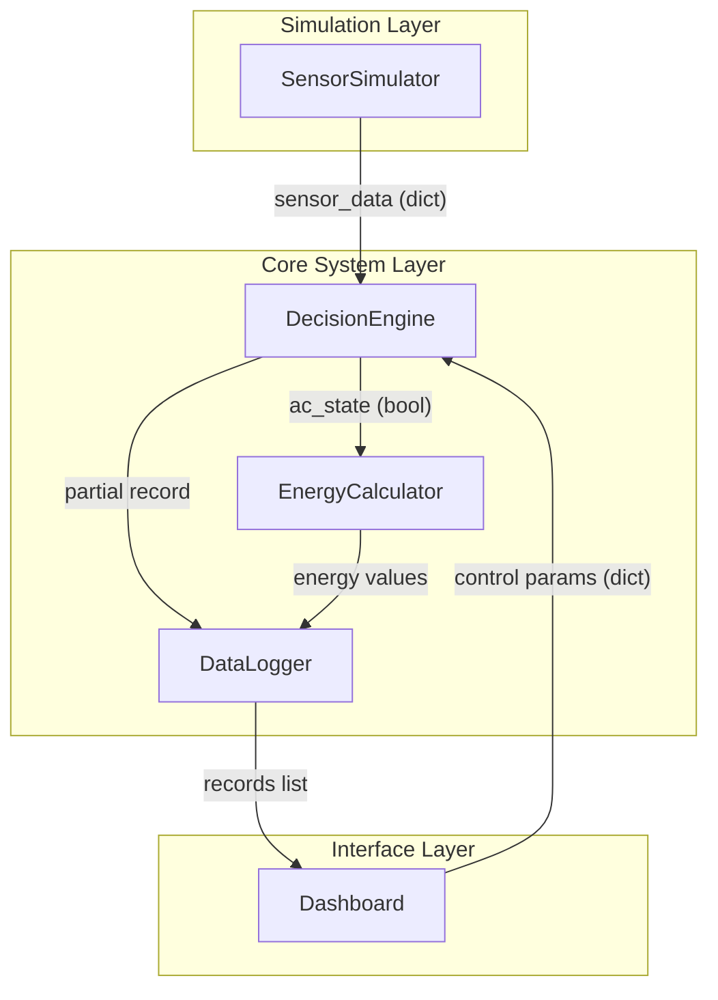
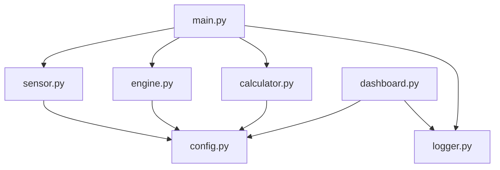
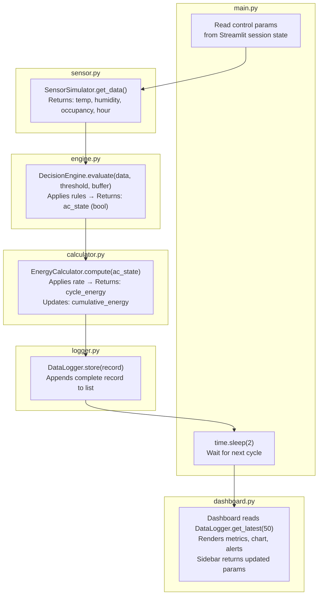
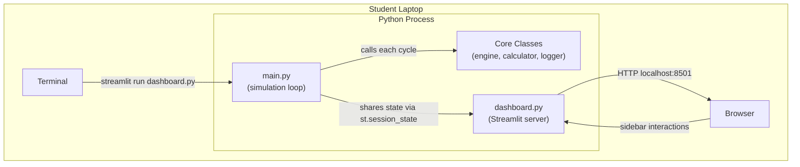

# 📐 High-Level Design (HLD)
## Smart Energy Optimization System

**Version:** 1.0
**Date:** April 2026
**Prepared by:** Emertxe Information Technologies
**Reference:** SRS v1.0

---

## Table of Contents

1. [Purpose and Scope](#1-purpose-and-scope)
2. [System Context](#2-system-context)
3. [Architectural Goals](#3-architectural-goals)
4. [Architecture Overview](#4-architecture-overview)
5. [Layer Descriptions](#5-layer-descriptions)
6. [Module Map](#6-module-map)
7. [Data Flow](#7-data-flow)
8. [Technology Choices and Rationale](#8-technology-choices-and-rationale)
9. [Design Principles](#9-design-principles)
10. [Deployment View](#10-deployment-view)

---

## 1. Purpose and Scope

This document describes the high-level architecture of the Smart Energy Optimization System (SEOS). It explains how the system is structured into layers and modules, why those structural choices were made, and how data moves through the system.

**Relationship to other documents:**

| Document | Purpose |
|---|---|
| SRS (`requirements.md`) | Defines *what* the system must do |
| HLD (this document) | Defines *how* the system is structured |
| LLD (`lld.md`) | Defines *how* each class and method is implemented |

**Audience:** Engineers implementing the system, and senior engineers reviewing the design before implementation begins.

---

## 2. System Context

SEOS is a standalone simulation application that serves as the **proof of concept** for a real-world Building Management System (BMS). In production, sensors and actuators would be physical hardware. In this phase, they are simulated entirely in software.



The key insight: the `DecisionEngine` is not a simulation — it is the real control logic. Only the sensor inputs and dashboard output are simulated. This means the algorithm validated here can be directly deployed with real hardware in Phase 2.

---

## 3. Architectural Goals

| Goal | Description |
|---|---|
| **Separation of concerns** | Each responsibility (sensing, deciding, calculating, logging, displaying) lives in exactly one class |
| **Teachability** | A student new to Python should be able to trace a single data cycle from sensor to dashboard |
| **No hidden dependencies** | Data flows in one direction; no module calls back into a module above it |
| **Configurability** | No control parameter is hardcoded inside logic; all come from a central defaults location or the dashboard |
| **Minimal setup** | The system runs with three terminal commands on any laptop |

---

## 4. Architecture Overview

SEOS is organised into three layers. Each layer has a single responsibility and communicates only with adjacent layers.



**Key architectural rule:** Dependencies only flow downward (Simulation → Core → Interface) with one exception: the Dashboard sends user-configured parameters up to the DecisionEngine. This is the control feedback loop and is the only upward dependency in the system.

---

## 5. Layer Descriptions

### 5.1 Simulation Layer

**Purpose:** Replace physical IoT sensors with software-generated data.

**What it does:**
- Generates temperature, humidity, occupancy, and hour values each cycle
- Simulates gradual temperature change (not random jumps) so that hysteresis behaviour is visible
- Has no knowledge of what happens to the data after it is returned

**What it does NOT do:**
- Make any decisions about devices
- Store any data
- Talk to the dashboard

---

### 5.2 Core System Layer

This is the heart of the system. It contains three collaborating components:

#### DecisionEngine
- Receives sensor data and control parameters
- Applies priority-ordered rules (occupancy → time → temperature + hysteresis)
- Maintains the current AC state across cycles (stateful)
- Returns a single boolean: AC ON or OFF

#### EnergyCalculator
- Receives the AC state from DecisionEngine
- Applies fixed energy rates (ON: 2.0 units, OFF: 0.1 units)
- Accumulates a running total
- Stateful: holds cumulative energy across all cycles

#### DataLogger
- Receives a complete record (sensor data + AC state + energy values)
- Appends it to an in-memory list
- Provides `get_latest(n)` for the dashboard to read

All three components are stateful — they carry information across cycles. This is why they are class instances, not standalone functions.

---

### 5.3 Interface Layer

**Purpose:** Present system state to the user and collect configuration input.

**What it does:**
- Reads the latest records from DataLogger
- Renders metrics, charts, and alert banners
- Provides a sidebar with sliders and inputs for control parameters
- Returns the current parameter values to the simulation loop each refresh

**What it does NOT do:**
- Perform any calculations
- Make any device decisions
- Store any data itself

---

## 6. Module Map

### 6.1 File Structure

```
SmartEnergyOptimizationSystem/
│
├── src/
│   ├── config.py      # All default values in one place
│   ├── sensor.py      # SensorSimulator class
│   ├── engine.py      # DecisionEngine class
│   ├── calculator.py  # EnergyCalculator class
│   ├── logger.py      # DataLogger class
│   ├── dashboard.py   # Streamlit app — Interface Layer entry point
│   └── main.py        # Terminal runner — wires all components together
│
├── Docs/
│   ├── requirements.md
│   ├── hld.md          (this document)
│   └── lld.md
│
├── requirements.txt
├── README.md
└── CLAUDE.md
```

### 6.2 Import Dependency Diagram



**Rule:** No core class (`sensor`, `engine`, `calculator`, `logger`) imports from another core class. They are wired together only in `main.py`. This keeps each class independently testable.

---

## 7. Data Flow

### 7.1 Single Cycle — End to End

The following diagram traces one complete simulation cycle:



### 7.2 Data Transformation at Each Step

| Step | Input | Output |
|---|---|---|
| SensorSimulator → DecisionEngine | Nothing | `{temp, humidity, occupancy, hour}` |
| DecisionEngine → EnergyCalculator | sensor dict + params | `ac_state` (bool) |
| EnergyCalculator → DataLogger | `ac_state` | `cycle_energy`, `cumulative_energy` |
| DataLogger stores | all of the above | One complete record appended |
| DataLogger → Dashboard | nothing | List of last 50 records |

---

## 8. Technology Choices and Rationale

### 8.1 Python

**Chosen because:**
- Readable syntax — a student can trace logic without fighting the language
- Rich standard library — `random`, `datetime`, `time` are all built-in
- Industry-relevant for data and IoT work

**Alternatives considered:** None. Python-only is a project constraint (SRS §9.1).

---

### 8.2 Streamlit (over Flask)

**Chosen because:**
- Pure Python — students write no HTML, CSS, or JavaScript
- Live refresh built-in via `st.empty()` + `time.sleep()` loop — no polling or websocket setup
- Sidebar widgets (`st.slider`, `st.number_input`) give interactive controls in three lines of code
- Visual feedback is immediate — charts and metrics update without page reload
- Students can read the entire dashboard file and understand it on Day 1

**Flask alternative:**
- Requires Jinja2 templates (HTML) — introduces a second language mid-project
- Auto-refresh needs a meta tag or AJAX polling — extra complexity
- Interactive controls need form submissions or JavaScript

**Trade-off accepted:** Streamlit runs its own event loop, which means the simulation loop and dashboard loop must be coordinated via `st.session_state`. This is slightly non-obvious but is explained in detail in the LLD.

---

### 8.3 In-Memory Storage (over SQLite/CSV)

**Chosen because:**
- Zero setup — no database install, no file path management
- A Python list is the simplest possible data structure students know
- The simulation is a single-session tool; persistence across restarts adds no value for v1
- `DataLogger` can be swapped for a file-backed version in v2 without changing any other class

**Trade-off accepted:** All data is lost when the simulation stops. This is acceptable for a proof-of-concept.

---

### 8.4 Gradual Temperature Simulation

**Chosen because:**
- Random per-cycle temperature would cause AC to toggle every few seconds regardless of hysteresis
- Gradual change (±1–2°C per cycle) makes the hysteresis band visible and understandable
- Students can observe the AC staying ON while temperature slowly drops toward the lower bound, then turning OFF — this is the key learning moment

---

## 9. Design Principles

### 9.1 Single Responsibility

Every class has exactly one job:

| Class | Job |
|---|---|
| `SensorSimulator` | Generate data |
| `DecisionEngine` | Make decisions |
| `EnergyCalculator` | Calculate energy |
| `DataLogger` | Store records |
| `Dashboard` | Display and collect input |

If you find yourself adding decision logic to `EnergyCalculator`, or storing data in `DecisionEngine`, the design is being violated.

### 9.2 Unidirectional Data Flow

Data flows downward through the pipeline. The only exception is the Dashboard → DecisionEngine parameter feedback, which is explicit and intentional (the control loop). No other upward dependencies exist.

### 9.3 Stateful Components

Three components carry state across cycles:

| Component | State it holds |
|---|---|
| `SensorSimulator` | `last_temp` — so next temperature is gradual |
| `DecisionEngine` | `ac_state` — so hysteresis can hold the current state |
| `EnergyCalculator` | `cumulative_energy` — running total |

These must be created as **single instances** in `main.py` and reused every cycle — not re-instantiated each cycle.

### 9.4 Configuration in One Place

All default values (threshold, rates, buffer, operational hours) live in `config.py`. No other file contains magic numbers. This means a student can change any default in one place and see the effect across the system.

---

## 10. Deployment View



**How it runs:**

When the student runs `streamlit run dashboard.py`, Streamlit launches a local web server on `localhost:8501`. The dashboard script contains the simulation loop. Streamlit re-executes the script on each refresh, but `st.session_state` preserves the class instances (SensorSimulator, DecisionEngine, etc.) between refreshes so state is not lost.

**Install and run (3 commands):**

```bash
python3 -m venv venv && source venv/bin/activate   # Windows: venv\Scripts\activate
pip install -r requirements.txt
streamlit run src/dashboard.py
```

---

*End of HLD — See `lld.md` for class-level detail and pseudocode.*
