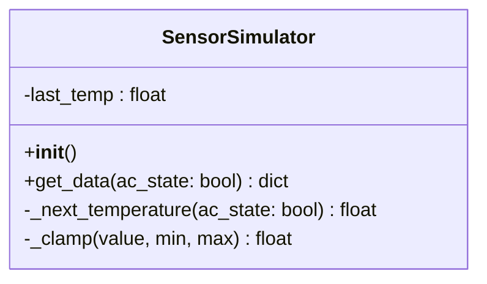
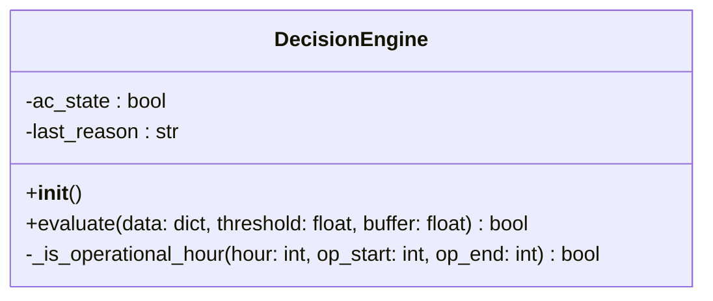
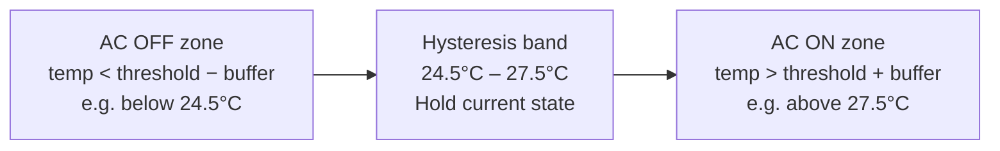
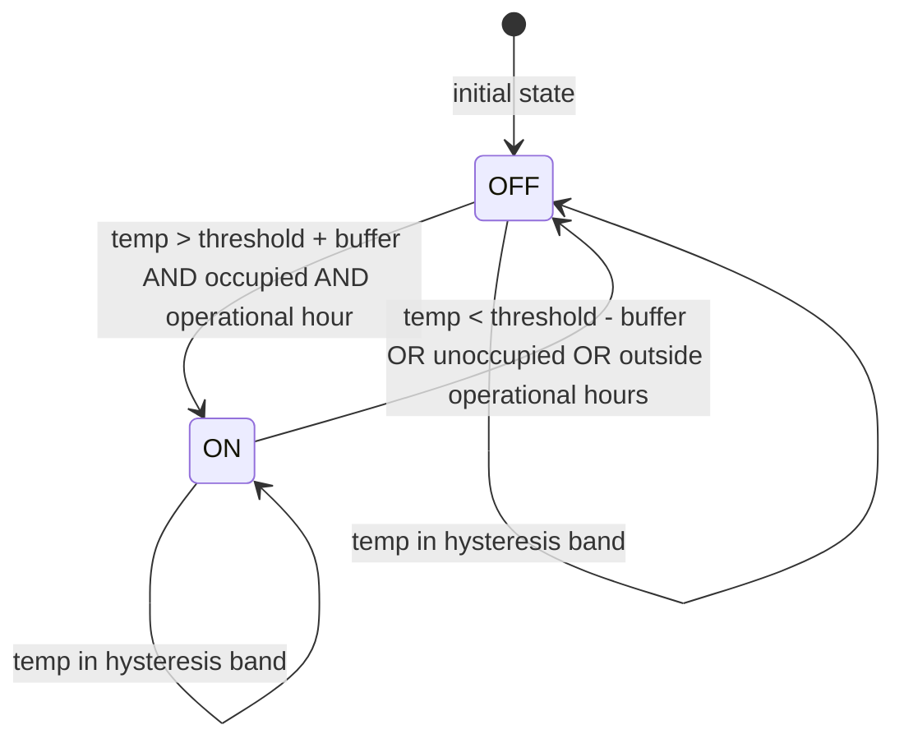
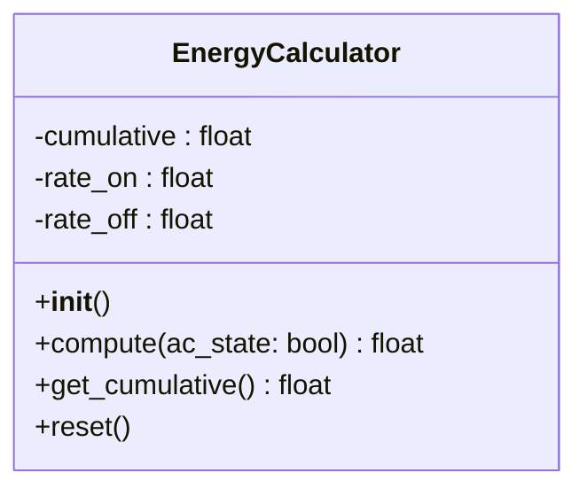
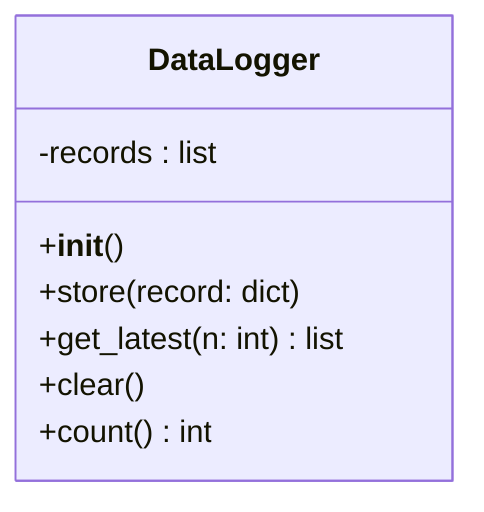
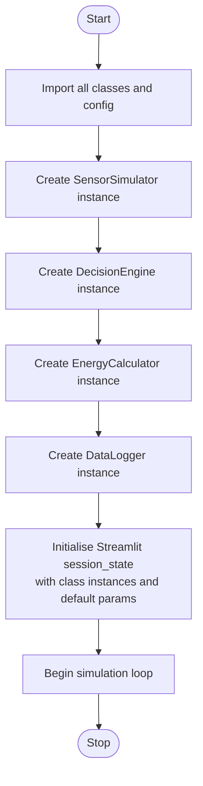
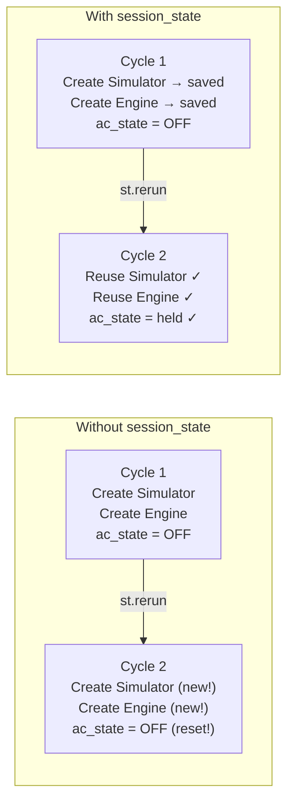

# 🔧 Low-Level Design (LLD)
## Smart Energy Optimization System

**Version:** 1.0
**Date:** April 2026
**Prepared by:** Emertxe Information Technologies
**Reference:** SRS v1.0, HLD v1.0

---

## Table of Contents

1. [File and Folder Structure](#1-file-and-folder-structure)
2. [Configuration Module](#2-configuration-module)
3. [SensorSimulator](#3-sensorsimulator)
4. [DecisionEngine](#4-decisionengine)
5. [EnergyCalculator](#5-energycalculator)
6. [DataLogger](#6-datalogger)
7. [Simulation Loop — main.py](#7-simulation-loop--mainpy)
8. [Dashboard — dashboard.py](#8-dashboard--dashboardpy)
9. [Inter-Module Dependency Summary](#9-inter-module-dependency-summary)
10. [Error Handling Strategy](#10-error-handling-strategy)

---

## 1. File and Folder Structure

```
SmartEnergyOptimizationSystem/
│
├── src/
│   ├── config.py      ← All default constants
│   ├── sensor.py      ← SensorSimulator class
│   ├── engine.py      ← DecisionEngine class
│   ├── calculator.py  ← EnergyCalculator class
│   ├── logger.py      ← DataLogger class
│   ├── dashboard.py   ← Streamlit app (entry point)
│   └── main.py        ← Terminal runner (optional, no dashboard)
│
├── Docs/
├── requirements.txt
├── README.md
└── CLAUDE.md
```

**`requirements.txt` contents:**
```
streamlit>=1.32.0
pandas>=2.0.0
```

All files inside `src/` import from each other using plain module names (`from sensor import ...`). This works because when Streamlit or Python runs a file from `src/`, it adds `src/` to `sys.path` automatically.

**Run commands:**
```bash
streamlit run src/dashboard.py   # full dashboard
python3 src/main.py              # terminal only
```

---

## 2. Configuration Module

**File:** `config.py`

All default values live here. No other file hardcodes these values — they import from `config.py`.

```
config.py
─────────────────────────────────────────────
Constants:

  # Sensor ranges
  TEMP_MIN       = 18.0       # °C
  TEMP_MAX       = 40.0       # °C
  HUMIDITY_MIN   = 30.0       # %
  HUMIDITY_MAX   = 90.0       # %
  TEMP_INIT      = 24.0       # Starting temperature °C
  TEMP_DRIFT_MAX = 2.0        # Max °C change per cycle

  # Decision Engine defaults
  DEFAULT_THRESHOLD    = 26.0   # °C
  DEFAULT_BUFFER       = 1.5    # °C (hysteresis)
  DEFAULT_OP_START     = 6      # hour (06:00)
  DEFAULT_OP_END       = 23     # hour (23:00)

  # Energy rates (units per cycle)
  RATE_ON          = 2.0
  RATE_OFF         = 0.1

  # Dashboard
  DEFAULT_ENERGY_LIMIT = 50.0   # units
  REFRESH_INTERVAL     = 2      # seconds
  LOG_DISPLAY_COUNT    = 50     # records shown on chart
  HIGH_TEMP_ALERT_DELTA = 5.0   # °C above threshold = alert
```

---

## 3. SensorSimulator

**File:** `sensor.py`

### 3.1 Responsibility

Generate one sensor reading per cycle. Temperature must change gradually across cycles to make hysteresis observable.

### 3.2 Class Diagram



### 3.3 Attributes

| Attribute | Type | Initial Value | Description |
|---|---|---|---|
| `last_temp` | float | `TEMP_INIT` (28.0) | Temperature from the previous cycle |

### 3.4 Method: `__init__()`

```
INIT:
  self.last_temp = TEMP_INIT   # 28.0°C — above ON threshold so AC activates on cycle 1
```

### 3.5 Method: `_next_temperature(ac_state) → float`

Generates the next temperature value with drift direction biased by the previous cycle's AC state.

```
FUNCTION _next_temperature(ac_state):
  IF ac_state == True:              # AC was ON last cycle → room cools
    drift = random float in [-2.0, +0.5]
  ELSE:                             # AC was OFF last cycle → room heats
    drift = random float in [-0.5, +2.0]

  new_temp = clamp(last_temp + drift, TEMP_MIN, TEMP_MAX)
  last_temp = new_temp
  RETURN new_temp
```

**Why AC-state-dependent drift?** If drift were purely random, the AC would have no observable effect on temperature — the room would not cool when AC is ON. Biasing the drift creates a realistic feedback loop: AC ON → room cools → AC turns OFF → room heats → AC turns ON again. Students watch this cycle live on the dashboard.

### 3.6 Method: `get_data(ac_state=False) → dict`

```
FUNCTION get_data(ac_state=False):
  temp      = _next_temperature(ac_state)   # previous cycle's AC state drives drift
  humidity  = random float in [HUMIDITY_MIN, HUMIDITY_MAX], rounded to 1 decimal
  occupancy = random choice [1, 0] weighted 70% / 30%
  hour      = current hour from system clock

  RETURN {
    "temperature" : temp,
    "humidity"    : humidity,
    "occupancy"   : occupancy,
    "hour"        : hour
  }
```

**Occupancy weighting (70/30):** A 50/50 split would show the AC turning off too frequently. 70% occupied better simulates a working office and makes energy patterns more interesting to observe.

**Caller pattern:** The simulation loop passes `engine.ac_state` (the previous cycle's decision) into `get_data()`. This is the correct order — the AC ran for the last 2 seconds, and its effect is what we measure now.

### 3.7 Example Output

```python
{
    "temperature": 27.3,
    "humidity": 58.4,
    "occupancy": 1,
    "hour": 14
}
```

---

## 4. DecisionEngine

**File:** `engine.py`

### 4.1 Responsibility

Apply priority-ordered rules to determine whether the AC should be ON or OFF. Maintain the current AC state across cycles to implement hysteresis.

### 4.2 Class Diagram



### 4.3 Attributes

| Attribute | Type | Initial Value | Description |
|---|---|---|---|
| `ac_state` | bool | `False` | Current AC state; persists between cycles |
| `last_reason` | str | `"Simulation starting..."` | Human-readable explanation of the rule that fired last cycle; read by dashboard |

### 4.4 Method: `__init__()`

```
INIT:
  self.ac_state    = False
  self.last_reason = "Simulation starting..."
```

### 4.5 Method: `evaluate(data, threshold, buffer, op_start, op_end) → bool`

This is the core algorithm of the entire system. Rules are applied in priority order — once a rule matches, the remaining rules are skipped.

```
FUNCTION evaluate(data, threshold, buffer, op_start, op_end):

  temp  = data["temperature"]
  occ   = data["occupancy"]
  hour  = data["hour"]
  upper = threshold + buffer        # e.g. 27.5°C
  lower = threshold - buffer        # e.g. 24.5°C

  # Rule 1 — Highest priority: occupancy check
  IF occ == 0:
    ac_state    = False
    last_reason = "Rule 1: Room is unoccupied → AC OFF"
    RETURN ac_state

  # Rule 2 — Time of day check
  IF hour < op_start OR hour >= op_end:
    ac_state    = False
    last_reason = "Rule 2: Outside operational hours ({hour}:00) → AC OFF"
    RETURN ac_state

  # Rule 3 — Temperature above upper hysteresis bound → turn ON
  IF temp > upper:
    ac_state    = True
    last_reason = "Rule 3: {temp}°C > upper threshold {upper}°C → AC ON"
    RETURN ac_state

  # Rule 4 — Temperature below lower hysteresis bound → turn OFF
  IF temp < lower:
    ac_state    = False
    last_reason = "Rule 4: {temp}°C < lower threshold {lower}°C → AC OFF"
    RETURN ac_state

  # Rule 5 — Within hysteresis band → hold current state
  state_str   = "ON" IF ac_state ELSE "OFF"
  last_reason = "Rule 5: {temp}°C within band ({lower}°C – {upper}°C) → Holding {state_str}"
  RETURN ac_state   # unchanged
```

### 4.6 Hysteresis Explained



**Without hysteresis:** If threshold = 26°C and temperature oscillates between 25.9°C and 26.1°C, the AC would toggle every single cycle — unrealistic and damaging to real equipment.

**With hysteresis:** The AC only turns ON once temperature reaches 27.5°C. It then stays ON until temperature drops to 24.5°C, even if it briefly dips to 25°C and back.

### 4.7 Method: `_is_operational_hour(hour, op_start, op_end) → bool`

```
FUNCTION _is_operational_hour(hour, op_start, op_end):
  RETURN op_start <= hour < op_end
```

### 4.8 State Diagram



---

## 5. EnergyCalculator

**File:** `calculator.py`

### 5.1 Responsibility

Calculate energy consumed in each cycle and maintain a running cumulative total.

### 5.2 Class Diagram



### 5.3 Attributes

| Attribute | Type | Initial Value | Description |
|---|---|---|---|
| `cumulative` | float | `0.0` | Total energy consumed since simulation start |
| `rate_on` | float | `RATE_ON` (2.0) | Energy units consumed per cycle when AC is ON |
| `rate_off` | float | `RATE_OFF` (0.1) | Energy units consumed per cycle when AC is OFF |

### 5.4 Method: `compute(ac_state) → float`

```
FUNCTION compute(ac_state):
  IF ac_state == True:
    cycle_energy = rate_on       # 2.0 units
  ELSE:
    cycle_energy = rate_off      # 0.1 units (standby)

  cumulative = cumulative + cycle_energy
  RETURN cycle_energy
```

**Why charge standby energy when AC is OFF?** Real AC units consume a small amount even when idle (control board, sensors). This also ensures the cumulative energy graph never flatlines, making it easier to observe the difference between ON and OFF periods.

### 5.5 Method: `get_cumulative() → float`

```
FUNCTION get_cumulative():
  RETURN cumulative
```

### 5.6 Method: `reset()`

```
FUNCTION reset():
  cumulative = 0.0
```

Used if the instructor or student wants to restart the energy counter without restarting the simulation.

---

## 6. DataLogger

**File:** `logger.py`

### 6.1 Responsibility

Store one complete record per cycle in memory and serve the most recent N records to the dashboard.

### 6.2 Class Diagram



### 6.3 Attributes

| Attribute | Type | Initial Value | Description |
|---|---|---|---|
| `records` | list | `[]` | In-memory list of all cycle records |

### 6.4 Method: `store(record: dict)`

```
FUNCTION store(record):
  records.append(record)
```

The caller (`main.py`) is responsible for assembling the complete record dict before calling `store()`.

### 6.5 Method: `get_latest(n: int) → list`

```
FUNCTION get_latest(n):
  IF length of records <= n:
    RETURN all records
  ELSE:
    RETURN last n records
```

In Python: `return self.records[-n:]`

### 6.6 Complete Record Structure

The record dict assembled in `main.py` before calling `store()`:

```
{
  "timestamp"        : current datetime formatted as "YYYY-MM-DD HH:MM:SS"
  "temperature"      : float   (from SensorSimulator)
  "humidity"         : float   (from SensorSimulator)
  "occupancy"        : int     (from SensorSimulator)
  "hour"             : int     (from SensorSimulator)
  "ac_state"         : bool    (from DecisionEngine)
  "cycle_energy"     : float   (from EnergyCalculator.compute())
  "cumulative_energy": float   (from EnergyCalculator.get_cumulative())
  "reason"           : str     (from DecisionEngine.last_reason)
}
```

---

## 7. Simulation Loop — main.py

**File:** `dashboard.py` (the loop lives inside the Streamlit app — see Section 8)

> **Note:** A standalone `main.py` can be created for testing the core logic without the dashboard. The loop design below applies to both.

### 7.1 Startup Sequence



### 7.2 Simulation Loop Pseudocode

```
STARTUP (runs once):
  IF session_state does not have "simulator":
    session_state.simulator   = new SensorSimulator()
    session_state.engine      = new DecisionEngine()
    session_state.calculator  = new EnergyCalculator()
    session_state.logger      = new DataLogger()

MAIN LOOP (runs every Streamlit refresh):

  # Step 1: Collect control params from sidebar
  params = render_sidebar()   # returns dict of threshold, buffer, limits, hours

  # Step 2: Generate sensor data (pass previous AC state to bias temperature drift)
  data = session_state.simulator.get_data(session_state.engine.ac_state)

  # Step 3: Make AC decision (also sets engine.last_reason)
  ac_state = session_state.engine.evaluate(
               data,
               params["threshold"],
               params["buffer"],
               params["op_start"],
               params["op_end"]
             )

  # Step 4: Calculate energy
  cycle_energy = session_state.calculator.compute(ac_state)
  cumulative   = session_state.calculator.get_cumulative()

  # Step 5: Build and store record
  record = {
    "timestamp"         : now formatted as string,
    "temperature"       : data["temperature"],
    "humidity"          : data["humidity"],
    "occupancy"         : data["occupancy"],
    "hour"              : data["hour"],
    "ac_state"          : ac_state,
    "cycle_energy"      : cycle_energy,
    "cumulative_energy" : cumulative,
    "reason"            : session_state.engine.last_reason
  }
  session_state.logger.store(record)

  # Step 6: Render dashboard
  records = session_state.logger.get_latest(LOG_DISPLAY_COUNT)
  render_dashboard(records, params)

  # Step 7: Wait then trigger next cycle
  time.sleep(REFRESH_INTERVAL)
  st.rerun()
```

**Why `st.rerun()`?** Streamlit does not loop continuously like a normal Python script. `st.rerun()` tells Streamlit to re-execute the entire script from the top, triggering the next cycle. Combined with `st.session_state`, this simulates an infinite loop while keeping the dashboard responsive.

---

## 8. Dashboard — dashboard.py

**File:** `dashboard.py`

### 8.1 Page Layout

```
┌──────────────────────────────────────────────────────────────────┐
│  Sidebar                  │  Main Area                            │
│  ─────────────────────    │  ─────────────────────────────────── │
│  Temperature Threshold    │  [ALERT BANNERS if active]            │
│  [slider 20–35°C]         │                                       │
│                           │  [DECISION REASON BANNER]             │
│  Hysteresis Buffer        │  "Rule 3: 28°C > 27.5°C → AC ON"     │
│  [slider 0.5–3°C]         │  (colour-coded by rule)               │
│                           │                                       │
│  Energy Limit             │  [Temp] [Humidity] [Occupancy] [AC]  │
│  [number input]           │                                       │
│                           │  [Cycle Energy]  [Cumulative Energy]  │
│  Operational Hours        │                                       │
│  Start: [0–12]            │  Temperature vs Thresholds (chart)    │
│  End:   [13–23]           │  — Temperature line                   │
│                           │  — Upper threshold line               │
│  ─────────────────────    │  — Lower threshold line               │
│  Hysteresis Band info     │                                       │
│  ON above X°C             │  Cycle Energy (chart)                 │
│  OFF below Y°C            │  — Spikes at 2.0 when ON             │
│                           │  — Flat at 0.1 when OFF               │
│                           │                                       │
│                           │  Recent Log table (last 10 cycles)    │
│                           │  includes Reason column               │
└──────────────────────────────────────────────────────────────────┘
```

### 8.2 Method: `render_sidebar() → dict`

```
FUNCTION render_sidebar():
  st.sidebar.header("Control Parameters")

  threshold = st.sidebar.slider(
                "Temperature Threshold (°C)",
                min=20.0, max=35.0,
                default=DEFAULT_THRESHOLD, step=0.5
              )
  buffer = st.sidebar.slider(
             "Hysteresis Buffer (°C)",
             min=0.5, max=3.0,
             default=DEFAULT_BUFFER, step=0.5
           )
  energy_limit = st.sidebar.number_input(
                   "Energy Limit (units)",
                   min=10, max=200,
                   default=DEFAULT_ENERGY_LIMIT
                 )
  op_start = st.sidebar.number_input(
               "Operational Start Hour",
               min=0, max=12,
               default=DEFAULT_OP_START
             )
  op_end = st.sidebar.number_input(
             "Operational End Hour",
             min=13, max=23,
             default=DEFAULT_OP_END
           )

  RETURN {
    "threshold"    : threshold,
    "buffer"       : buffer,
    "energy_limit" : energy_limit,
    "op_start"     : op_start,
    "op_end"       : op_end
  }
```

### 8.3 Method: `render_decision_reason(reason)`

Colour-codes the reason banner by rule number so students can immediately see which rule fired.

```
FUNCTION render_decision_reason(reason):
  IF "Rule 1" OR "Rule 2" in reason:
    st.warning(reason)    # yellow — occupancy / time override
  ELSE IF "Rule 3" in reason:
    st.error(reason)      # red — room is hot, AC turning ON
  ELSE IF "Rule 4" in reason:
    st.success(reason)    # green — room cooled, AC turning OFF
  ELSE:
    st.info(reason)       # blue — Rule 5, hysteresis holding
```

### 8.4 Method: `render_dashboard(records, params)`

```
FUNCTION render_dashboard(records, params):

  latest = records[-1]
  upper  = params["threshold"] + params["buffer"]
  lower  = params["threshold"] - params["buffer"]

  # 1. Alerts
  IF latest["temperature"] > params["threshold"] + HIGH_TEMP_ALERT_DELTA:
    st.error("⚠️ High Temperature Alert")
  IF latest["cumulative_energy"] > params["energy_limit"]:
    st.warning("⚠️ Energy Limit Exceeded")

  # 2. Decision reason (colour-coded)
  render_decision_reason(latest["reason"])

  # 3. Sensor readings + AC status (4 columns)
  col1, col2, col3, col4 = st.columns(4)
  col1.metric("Temperature (°C)", latest["temperature"])
  col2.metric("Humidity (%)",     latest["humidity"])
  col3.metric("Occupancy",        "Occupied" IF latest["occupancy"] ELSE "Empty")
  IF latest["ac_state"]:
    col4.success("🟢 AC: ON")
  ELSE:
    col4.error("🔴 AC: OFF")

  # 4. Energy metrics
  col5, col6 = st.columns(2)
  col5.metric("Cycle Energy (units)",      latest["cycle_energy"])
  col6.metric("Cumulative Energy (units)", latest["cumulative_energy"])

  # 5. Temperature chart with threshold reference lines
  temp_df = DataFrame({
    "Temperature (°C)"       : [r["temperature"] for r in records],
    "AC ON above ({upper}°C)": [upper for each record],
    "AC OFF below ({lower}°C)": [lower for each record],
  })
  st.line_chart(temp_df)

  # 6. Cycle energy chart — spikes reveal when AC is ON
  energy_df = DataFrame({
    "Cycle Energy (units)": [r["cycle_energy"] for r in records]
  })
  st.line_chart(energy_df)

  # 7. Recent log table (last 10, most recent first, includes Reason column)
  st.dataframe(last 10 records reversed, use_container_width=True)
```

### 8.4 Streamlit Session State — Why It Is Needed



Every time Streamlit refreshes, the entire script runs from the top. Without `session_state`, all class instances would be re-created and all state (ac_state, cumulative energy, temperature history) would be lost. `session_state` is a dictionary that survives across reruns — it is where the class instances must be stored.

**Initialisation pattern:**

```
IF "simulator" NOT IN st.session_state:
  st.session_state.simulator  = SensorSimulator()
  st.session_state.engine     = DecisionEngine()
  st.session_state.calculator = EnergyCalculator()
  st.session_state.logger     = DataLogger()
```

This block runs only once (on the very first load). Every subsequent rerun skips it and uses the existing instances.

---

## 9. Inter-Module Dependency Summary

| Module | Imports from | Imported by |
|---|---|---|
| `config.py` | nothing | all modules |
| `sensor.py` | `config` | `dashboard.py` (via session_state) |
| `engine.py` | `config` | `dashboard.py` (via session_state) |
| `calculator.py` | `config` | `dashboard.py` (via session_state) |
| `logger.py` | `config` | `dashboard.py` (via session_state) |
| `dashboard.py` | `config`, all classes | nothing (entry point) |

**No circular imports exist.** Every import arrow is unidirectional.

---

## 10. Error Handling Strategy

### 10.1 Principle

Handle errors at the boundary where data enters the system (SensorSimulator output). Trust internal logic once data is validated.

### 10.2 Invalid Sensor Values

If a sensor value is out of range (e.g., due to a future integration with a real sensor that sends corrupt data), clamp it rather than crash.

```
FUNCTION _clamp(value, min_val, max_val):
  RETURN max(min_val, min(max_val, value))
```

Applied in `SensorSimulator._next_temperature()` to keep temperature within `[TEMP_MIN, TEMP_MAX]`.

### 10.3 Empty Log

If `DataLogger.get_latest(n)` is called before any records exist (first cycle not yet complete), it returns an empty list. `dashboard.py` must check for this before accessing `records[-1]`.

```
FUNCTION render_dashboard(records, params):
  IF length of records == 0:
    st.info("Simulation starting...")
    RETURN
  ...
```

### 10.4 What We Do NOT Handle

- Network failures (no network is used)
- File I/O errors (no files are written)
- Concurrent access (single-user, single-thread)
- Out-of-range slider values (Streamlit enforces min/max on sliders)

---

*End of LLD — See `hld.md` for architecture overview and design rationale.*
