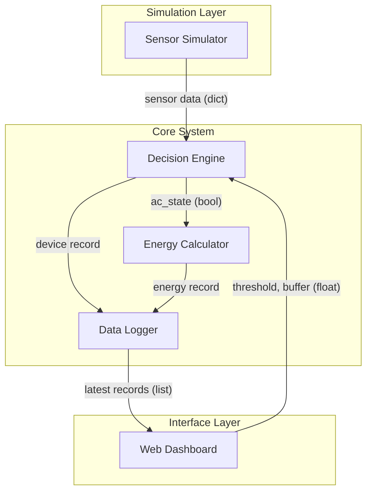
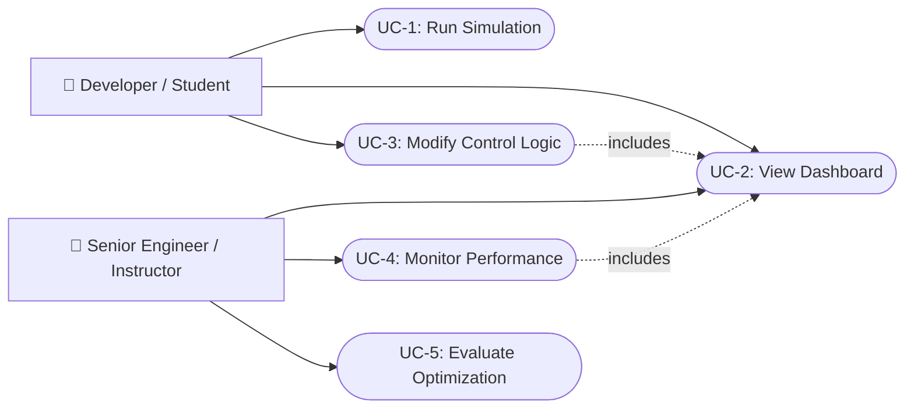
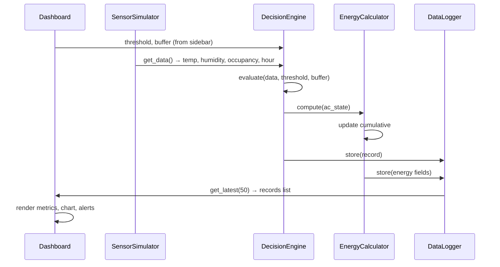
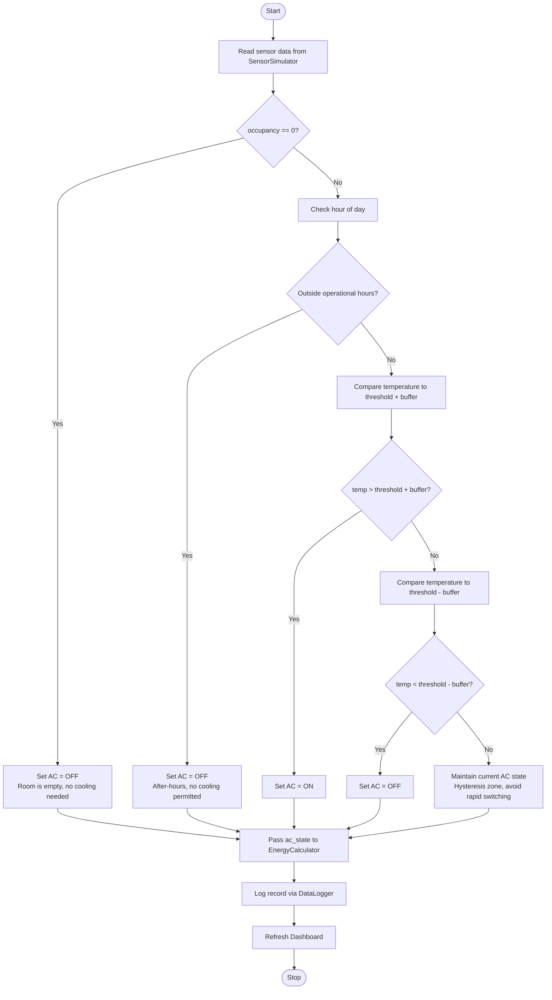
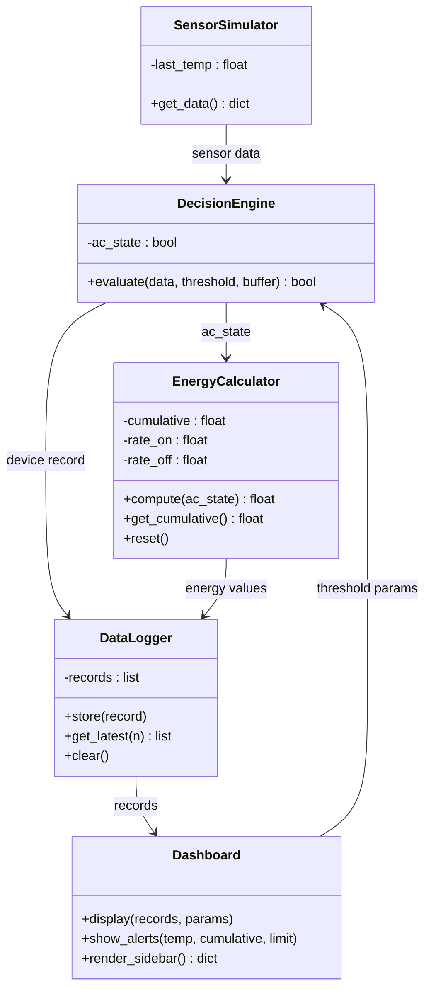

# 📄 Smart Energy Optimization System
## Software Requirements Specification (SRS)

**Version:** 1.0
**Date:** April 2026
**Prepared by:** Emertxe Information Technologies
**Client:** Nexus Business Park, Bengaluru

---

## Table of Contents

1. [Introduction](#1-introduction)
2. [Background and Problem Statement](#2-background-and-problem-statement)
3. [Overall Description](#3-overall-description)
4. [Functional Requirements](#4-functional-requirements)
5. [Use Case Descriptions](#5-use-case-descriptions)
6. [Non-Functional Requirements](#6-non-functional-requirements)
7. [System Models (UML)](#7-system-models-uml)
8. [Data Dictionary](#8-data-dictionary)
9. [Constraints and Assumptions](#9-constraints-and-assumptions)
10. [Future Enhancements](#10-future-enhancements)
11. [Acceptance Criteria](#11-acceptance-criteria)

---

## 1. Introduction

### 1.1 Purpose

This Software Requirements Specification (SRS) defines the functional and non-functional requirements for the **Smart Energy Optimization System (SEOS)**. The system is a Python-based IoT simulation that models intelligent HVAC (Heating, Ventilation, and Air Conditioning) control for commercial buildings.

This document is intended for:
- Engineering team members building and testing the system
- Senior engineers and project leads evaluating the implementation
- Stakeholders reviewing scope and acceptance criteria

### 1.2 Scope

SEOS will:

- Simulate environmental and occupancy sensor data for a building room
- Apply rule-based decision logic to control a virtual AC unit
- Track per-cycle and cumulative energy consumption
- Provide a real-time interactive web dashboard for monitoring and control
- Generate alerts when operating conditions exceed safe thresholds

This is a **software-only simulation**. No physical IoT hardware is required. The system is designed to demonstrate and validate the control logic and energy optimization algorithms that would be deployed in a real building management system (BMS).

### 1.3 Definitions and Acronyms

| Term / Acronym | Description |
|---|---|
| SEOS | Smart Energy Optimization System |
| BMS | Building Management System |
| HVAC | Heating, Ventilation, and Air Conditioning |
| IoT | Internet of Things |
| Occupancy | Whether a room is occupied (1) or empty (0) |
| Energy Unit | Simulated unit of electricity consumption (equivalent to 0.1 kWh in the real-world model) |
| Threshold | Configurable temperature value above which the AC is triggered |
| Hysteresis | A buffer zone around the threshold that prevents rapid ON/OFF switching |
| Cycle | One iteration of the simulation loop (approximately 2–5 seconds of real time) |
| Operational Hours | Time window during which AC is permitted to run (default: 06:00–23:00) |

### 1.4 Document Conventions

- **FR-n** — Functional Requirement number
- **NFR-n** — Non-Functional Requirement number
- **UC-n** — Use Case number
- *Shall* — Mandatory requirement
- *Should* — Recommended but not mandatory

---

## 2. Background and Problem Statement

### 2.1 Context

Commercial buildings in India account for approximately **33% of total electricity consumption**, with HVAC systems responsible for **40–60% of a building's energy use**. A major contributor to this waste is the use of fixed-schedule or manual AC control — systems that run regardless of whether a room is occupied or whether the temperature actually requires cooling.

Nexus Business Park is a 6-floor commercial office complex in Bengaluru housing approximately 800 employees across 40 rooms. The facility currently operates its HVAC systems on fixed daily timers set by the building management team. This approach results in:

- AC units running in empty rooms during lunch breaks, after-hours, and on weekends
- No temperature-based control — AC runs at full capacity even when the room is already cool
- No visibility into real-time energy consumption by room or floor
- Monthly electricity bills consistently **25–30% above** the industry benchmark for similar buildings

### 2.2 Problem Statement

> *"We have no way to know which rooms are consuming excess energy or why. Our facility team manually checks rooms twice a day, but by then, hours of electricity have already been wasted."*
> — Facility Manager, Nexus Business Park

The core problems are:

1. **No occupancy awareness** — AC runs on schedule regardless of room usage
2. **No temperature feedback** — No mechanism to turn off AC once the room reaches a comfortable temperature
3. **No real-time visibility** — Facility managers have no dashboard to monitor consumption
4. **No alerting** — Abnormal temperature spikes or energy overruns go unnoticed

### 2.3 Proposed Solution

SEOS addresses these problems by simulating an intelligent control layer that sits between sensors and the AC unit. The system continuously reads sensor data, evaluates conditions against configurable thresholds, and makes ON/OFF decisions every few seconds. A real-time dashboard gives facility managers full visibility and the ability to tune thresholds without touching code.

This simulation serves as the **proof of concept** for a full hardware deployment planned in Phase 2.

### 2.4 Expected Outcomes

| Metric | Current State | Target with SEOS |
|---|---|---|
| AC runtime in unoccupied rooms | ~4 hrs/day | 0 hrs/day |
| Average energy per room/day | 18 units | ≤ 12 units |
| Time to detect abnormal conditions | Hours (manual) | < 10 seconds |
| Visibility into consumption | None | Real-time dashboard |

---

## 3. Overall Description

### 3.1 Product Perspective

SEOS is a standalone simulation application. In the target real-world deployment, the Sensor Simulator would be replaced by actual IoT sensors (temperature, humidity, PIR occupancy sensors) and the AC control output would trigger real relay switches. For this phase, all hardware is simulated in software.

The system follows a linear data pipeline:

```
Sensor Simulator → Decision Engine → Energy Calculator → Data Logger → Dashboard
```

The Dashboard also feeds user-configured parameters (thresholds) back into the Decision Engine, creating a control loop.

### 3.2 System Architecture (UML — Component Diagram)



### 3.3 User Classes and Characteristics

| User | Role in System | Technical Level | Primary Goals |
|---|---|---|---|
| **Developer / Student** | Runs simulation, views dashboard, modifies control parameters via UI, experiments with logic | Beginner–Intermediate Python | Understand how control logic affects energy consumption; learn IoT system design |
| **Senior Engineer / Instructor** | Reviews simulation output, evaluates optimization effectiveness, compares threshold strategies | Intermediate–Advanced | Assess whether the system correctly implements requirements; evaluate energy savings |

### 3.4 Operating Environment

| Component | Specification |
|---|---|
| Language | Python 3.8 or higher |
| Dashboard | Streamlit |
| OS | Windows 10+, Ubuntu 20.04+, macOS 12+ |
| Hardware | Standard laptop (minimum 4 GB RAM, dual-core CPU) |
| Network | Local only (no internet required) |

### 3.5 Assumptions

- The simulation runs in real time; one simulation cycle = one observation interval (2–5 seconds)
- Sensor data is randomly generated within realistic ranges; no external data source is required
- A single room is simulated in this version; multi-room support is a future enhancement
- All data is stored in memory; persistence across restarts is not required in this version
- The system clock is used for time-of-day logic; no simulated clock is needed

---

## 4. Functional Requirements

### 4.1 Sensor Simulation

**FR-1:** The system shall generate one sensor reading per cycle containing:

| Field | Type | Simulated Range | Notes |
|---|---|---|---|
| `temperature` | float | 18.0 – 40.0 °C | Varies smoothly cycle-to-cycle (±1–2°C per step) |
| `humidity` | float | 30.0 – 90.0 % | Random within range |
| `occupancy` | int | 0 or 1 | 1 = occupied, 0 = empty |
| `hour` | int | 0 – 23 | Current hour from system clock |

Temperature changes shall be gradual (not random jumps) to simulate realistic sensor behaviour and to make hysteresis logic observable.

---

### 4.2 Decision Engine

**FR-2:** The system shall evaluate sensor data each cycle and determine whether the AC should be ON or OFF, according to the following priority-ordered rules:

| Priority | Condition | AC State |
|---|---|---|
| 1 (highest) | Room is unoccupied (`occupancy == 0`) | OFF |
| 2 | Current hour is outside operational hours | OFF |
| 3 | Temperature > `threshold + hysteresis_buffer` | ON |
| 4 | Temperature < `threshold - hysteresis_buffer` | OFF |
| 5 (lowest) | Temperature is within the hysteresis band | Maintain current state |

**FR-3:** The system shall implement hysteresis to prevent rapid switching:
- Default threshold: **26°C**
- Default hysteresis buffer: **1.5°C**
- This means AC turns ON above 27.5°C and turns OFF below 24.5°C
- While temperature is between 24.5°C and 27.5°C, the AC holds its current state

**FR-10:** Control parameters shall be configurable at runtime via the dashboard. Changes shall take effect from the next simulation cycle. The configurable parameters are:

| Parameter | Default | Allowed Range |
|---|---|---|
| Temperature threshold | 26°C | 20°C – 35°C |
| Hysteresis buffer | 1.5°C | 0.5°C – 3.0°C |
| Energy limit (alert trigger) | 50 units | 10 – 200 units |
| Operational start hour | 6 | 0 – 12 |
| Operational end hour | 23 | 13 – 23 |

---

### 4.3 Energy Calculation

**FR-4:** The system shall calculate energy consumed in each cycle based on AC state:

| AC State | Energy per Cycle |
|---|---|
| ON | 2.0 units |
| OFF | 0.1 units (standby) |

**FR-5:** The system shall maintain a running cumulative total of energy consumed since the simulation started.

---

### 4.4 Data Logging

**FR-6:** The system shall append one record to an in-memory log after each cycle. Each record shall contain:

| Field | Type | Description |
|---|---|---|
| `timestamp` | datetime | Date and time of the cycle |
| `temperature` | float | Sensor reading |
| `humidity` | float | Sensor reading |
| `occupancy` | int | 0 or 1 |
| `hour` | int | Hour of day |
| `ac_state` | bool | True = ON, False = OFF |
| `cycle_energy` | float | Energy consumed this cycle |
| `cumulative_energy` | float | Total energy since start |

The log shall retain all records for the duration of the session. The dashboard shall read the most recent N records for display (default N = 50).

---

### 4.5 Dashboard

**FR-7:** The dashboard shall display the following in real time:

- Current temperature, humidity, and occupancy (as metric cards)
- Current AC status (clearly indicated as ON / OFF with colour coding)
- Cycle energy and cumulative energy consumption
- **Decision reason** — which rule fired this cycle (e.g., "Rule 3: 28.0°C > upper threshold 27.5°C → AC ON"), colour-coded by rule number
- Temperature trend chart with upper and lower hysteresis threshold lines overlaid as reference
- Cycle energy chart showing 2.0 units when AC is ON and 0.1 units when OFF

**FR-8:** The dashboard shall auto-refresh every 2 seconds without requiring any user action.

**FR-11:** The dashboard shall provide a sidebar panel with interactive controls for all parameters listed in FR-10. Labels shall include units and allowed ranges.

---

### 4.6 Alerts

**FR-9:** The dashboard shall display a visible alert banner when either of the following conditions is true:

| Condition | Alert Message |
|---|---|
| `temperature > threshold + 5°C` | "⚠️ High Temperature Alert — Room temperature is critically high." |
| `cumulative_energy > energy_limit` | "⚠️ Energy Limit Exceeded — Cumulative usage has crossed the configured limit." |

Alerts shall remain visible until the condition is resolved.

---

## 5. Use Case Descriptions

### UC-1: Run Simulation

| Field | Detail |
|---|---|
| **Actor** | Developer / Student |
| **Precondition** | Python environment is set up; dependencies installed |
| **Trigger** | User runs `streamlit run dashboard.py` |
| **Main Flow** | 1. Dashboard launches in browser. 2. Simulation loop starts automatically. 3. Sensor data is generated each cycle. 4. Decision Engine evaluates conditions. 5. Energy is calculated and logged. 6. Dashboard updates every 2 seconds. |
| **Postcondition** | Simulation runs continuously; dashboard shows live data |
| **Alternate Flow** | If a sensor value is out of range, the system clamps it to the valid range and continues |

---

### UC-2: View Dashboard

| Field | Detail |
|---|---|
| **Actor** | Developer / Student, Senior Engineer / Instructor |
| **Precondition** | Simulation is running (UC-1 active) |
| **Trigger** | User opens the dashboard URL in a browser |
| **Main Flow** | 1. User sees current sensor readings, AC status, and energy metrics. 2. Energy trend chart updates with each refresh. 3. If thresholds are breached, alert banners appear at the top. |
| **Postcondition** | User has a current view of all system metrics |

---

### UC-3: Modify Control Logic

| Field | Detail |
|---|---|
| **Actor** | Developer / Student |
| **Precondition** | Simulation is running; dashboard is open |
| **Trigger** | User adjusts a slider or input in the sidebar |
| **Main Flow** | 1. User moves the temperature threshold slider to a new value. 2. The new value is passed to the Decision Engine at the next cycle. 3. AC state changes if the new threshold changes the evaluation outcome. 4. The effect is visible on the dashboard within 2 seconds. |
| **Postcondition** | System behaviour reflects the new parameters; energy trend shows the impact |
| **Example Scenario** | Student sets threshold from 26°C to 30°C. At 27°C room temperature, AC was previously ON; it now turns OFF. Cumulative energy growth rate slows visibly on the chart. |

---

### UC-4: Monitor Performance

| Field | Detail |
|---|---|
| **Actor** | Senior Engineer / Instructor |
| **Precondition** | Simulation has been running for several minutes |
| **Trigger** | Instructor reviews the dashboard after a student experiment |
| **Main Flow** | 1. Instructor observes the energy trend chart. 2. Compares energy usage under different threshold settings. 3. Checks whether alerts fired appropriately. 4. Evaluates whether hysteresis prevented unnecessary switching. |
| **Postcondition** | Instructor can assess whether the student's configuration achieves energy savings without comfort loss |

---

### UC-5: Evaluate Optimization

| Field | Detail |
|---|---|
| **Actor** | Senior Engineer / Instructor |
| **Precondition** | UC-3 has been performed with at least two different threshold settings |
| **Trigger** | Instructor wants to compare energy outcomes |
| **Main Flow** | 1. Instructor notes cumulative energy under Setting A. 2. Student resets simulation and applies Setting B. 3. After equivalent runtime, instructor compares cumulative energy. 4. The setting with lower cumulative energy and acceptable temperature is deemed more optimal. |
| **Postcondition** | A documented comparison of two control strategies exists |

---

## 6. Non-Functional Requirements

### NFR-1: Performance

- The simulation loop shall complete one full cycle (sense → decide → calculate → log → display) within **2 seconds** on the target hardware.
- The dashboard shall reflect the latest data within **2 seconds** of it being logged.

### NFR-2: Usability

- All metric labels shall include units (°C, %, units).
- Alert banners shall be visually distinct (coloured, prominent) from normal readings.
- Sidebar controls shall display current values alongside the slider/input.
- A first-time user with basic Python knowledge shall be able to run the simulation and understand the dashboard within **10 minutes**.

### NFR-3: Reliability

- The system shall handle out-of-range sensor values by clamping them to the valid range (not crashing).
- The simulation loop shall not terminate due to a single bad data point.
- The system shall run continuously for a minimum of **60 minutes** without error.

### NFR-4: Maintainability

- Each of the five core classes (`SensorSimulator`, `DecisionEngine`, `EnergyCalculator`, `DataLogger`, `Dashboard`) shall be implemented in a separate Python file.
- Control parameters shall not be hardcoded anywhere except as default values in one central location.
- A developer unfamiliar with the codebase shall be able to change the energy rate or threshold default in under **2 minutes**.

### NFR-5: Portability

- The system shall run without modification on Windows, Linux, and macOS.
- Setup shall require no more than three terminal commands (create venv, install requirements, run dashboard).

---

## 7. System Models (UML)

### 7.1 Use Case Diagram



---

### 7.2 Sequence Diagram — One Simulation Cycle



---

### 7.3 Activity Diagram — Decision Engine Logic



---

### 7.4 Class Diagram



---

## 8. Data Dictionary

### 8.1 Sensor Record (output of `SensorSimulator.get_data()`)

```python
{
    "temperature": 27.4,      # float, °C, range 18.0–40.0
    "humidity": 62.0,         # float, %, range 30.0–90.0
    "occupancy": 1,           # int, 0 or 1
    "hour": 14                # int, 0–23 (current hour)
}
```

### 8.2 Log Record (stored by `DataLogger.store()`)

```python
{
    "timestamp": "2026-04-24 14:32:05",   # str, formatted datetime
    "temperature": 27.4,                   # float, °C
    "humidity": 62.0,                      # float, %
    "occupancy": 1,                        # int, 0 or 1
    "hour": 14,                            # int
    "ac_state": True,                      # bool, True = ON
    "cycle_energy": 2.0,                   # float, energy units this cycle
    "cumulative_energy": 48.5,             # float, total since start
    "reason": "Rule 3: 27.4°C > upper threshold 27.5°C → AC ON"  # str, decision explanation
}
```

### 8.3 Control Parameters (from dashboard sidebar)

```python
{
    "threshold": 26.0,          # float, °C
    "buffer": 1.5,              # float, °C
    "energy_limit": 50.0,       # float, units
    "op_start_hour": 6,         # int, hour
    "op_end_hour": 23           # int, hour
}
```

---

## 9. Constraints and Assumptions

### 9.1 Constraints

- Implementation must use Python only (no other languages)
- No physical hardware or external IoT platform is required
- All data is in-memory; no database or file persistence is required in v1
- Must run on a standard student laptop without special hardware or GPU
- All control parameters must be adjustable from the dashboard without restarting

### 9.2 Assumptions

- One room is simulated; the architecture should not preclude future multi-room extension
- Temperature changes gradually (±1–2°C per cycle) to make hysteresis observable
- The simulation loop runs indefinitely until the user stops it
- System clock is used for real time; no simulated time acceleration is required
- Students have Python 3.8+ installed and basic familiarity with running terminal commands

---

## 10. Future Enhancements

| Enhancement | Description |
|---|---|
| Multi-room simulation | Simulate multiple rooms independently, each with its own sensor and AC unit |
| Persistent logging | Write log records to a CSV or SQLite database for post-session analysis |
| Cloud integration | Push data to a cloud endpoint (MQTT / REST API) for remote monitoring |
| Hardware integration | Replace `SensorSimulator` with real sensor reads (DHT22, PIR) via Raspberry Pi |
| ML-based prediction | Train a model on historical data to predict AC need before temperature rises |
| Mobile interface | Responsive dashboard or companion mobile app |
| Energy cost reporting | Map energy units to actual INR cost based on BESCOM tariff slabs |

---

## 11. Acceptance Criteria

The system is considered complete and ready for evaluation when all of the following are true:

| # | Criterion |
|---|---|
| AC-1 | System starts with a single command and dashboard opens in browser without errors |
| AC-2 | Dashboard displays live sensor readings, AC state, and energy metrics that update every 2 seconds |
| AC-3 | AC correctly turns OFF when occupancy is 0, regardless of temperature |
| AC-4 | AC correctly turns OFF outside configured operational hours |
| AC-5 | Hysteresis is demonstrable: AC does not toggle ON/OFF rapidly when temperature is near the threshold |
| AC-6 | Adjusting the threshold slider in the sidebar changes AC behaviour within 2 seconds |
| AC-7 | Cumulative energy grows faster when AC is ON than when it is OFF |
| AC-8 | Alert banners appear when temperature exceeds threshold + 5°C or energy exceeds the limit |
| AC-9 | System runs for 60 minutes without crashing or memory errors |
| AC-10 | A student can explain the role of each of the five classes when asked |

---

*End of Document*
